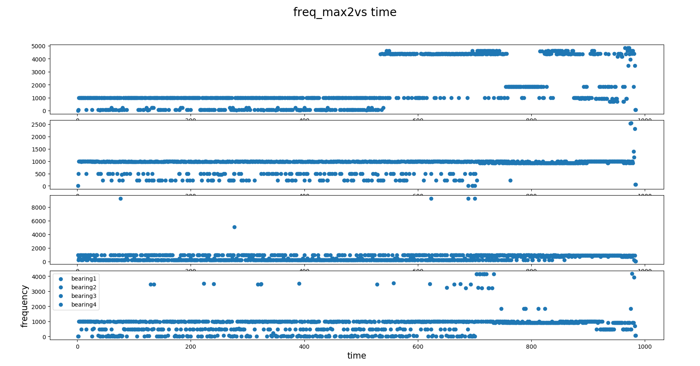

**Real-time time-series anomaly detection**

++
|  |
++
|  |
++
|  |
++
|  |
++
|  |
++

\

The monitoring of manufacturing equipment is vital to any industrial
process. Sometimes it is critical that equipment be monitored in
real-time for faults and anomalies to prevent damage and correlate
equipment behavior faults to production line issues. Fault detection is
the pre-cursor to predictive maintenance.

There are several methods which don’t require training of a neural
network to be able to detect failures, starting with the most basic
(FFT), to the most complex (Gaussian Mixture Model). These have the
advantage of being able to be re-used with minor modifications on
different data streams, and don’t require a lot of known previously
classified data (unlike neural nets). In fact, some of these methods can
be used to classify data in order to train DNNs.

**What you’ll learn**

-   -   

\

**Setup**

-   -   -   

1.  2.  3.  4.  5.  

-   -   

\

**Gather your materials**

-   

**Get the code:**

Open the example in console or any python supported IDE( Spyder ). Set
the working directory where your code and dataset is stored.

\
\

\
\

**Run the application:**

++
|  |
++
|  |
++
|  |
++

**How it works:**

**[1. FFT: ]{style="background: #ffffff"}**[A fast Fourier
transform (FFT) is an algorithm that samples a signal over a period of
time (or space) and divides it into its frequency components. These
components are single sinusoidal oscillations at distinct frequencies
each with their own amplitude and phase. ]{style="background: #ffffff"}

[Y](https://in.mathworks.com/help/matlab/ref/fft.html#f83-998360-Y) =
fft([X](https://in.mathworks.com/help/matlab/ref/fft.html#f83-998360-X)) computes
the discrete Fourier transform (DFT) of X using a fast Fourier transform
(FFT) algorithm. If X is a vector, then fft(X) returns the Fourier
transform of the vector[**.more
details**](https://en.wikipedia.org/wiki/Fast_Fourier_transform)

**Code Explanation:**

For all the samples the basic approach is same. Following are the steps
that are basic steps:

-   -   -   -   

**For FFT**: it gives the Frequency vs time plot of each maximum
frequency for each dataset.

{width="624" height="326"}

Fig: plot for the testset2, max2 frequency for all the bearing.

**NOTE:**

TESTSET 3 of Nasa bearing dataset is discarded for the observations
because of the following reason:

1: It has 6324 file in actual, but according to the documentation its
contains 4448 data file. This makes very noisy data.

2: None of the bearing show the symptom of failure, it suddenly fails.
So it makes data inconsistent,

These listed reason become why testset3 shows unpredictable behavior.

\
\

\
\

\

